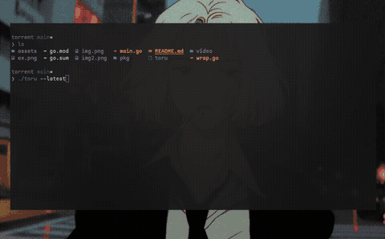
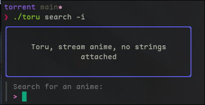

<p align="center">
  
<br>
<a href="http://makeapullrequest.com"></a>
<a href="#Linux">
<a href="#MacOS">
<a href="#Android">
<a href="#Windows">
<a href="#iOS">
<a href="#Steam-deck">
<br>
<a href="https://github.com/sweetbbak"></a>
<br>
</p>

<p align="center">
<a href="#golang">
<a href="go">
<a href="linux">
<a href="bsd">
<a href="mac">
</p>

<h3 align="center">
A CLI tool to browse and stream anime with the power of web-torrents. Ani-cli meets Miru.
</h3>


`toru` allows you to stream torrents from the command line. You can view the latest anime on nyaa.si
or provide a search query and then pick an anime from a fzf-like interface, and then stream that episode
directly from the command line in MPV or your favorite video player (including the browser).

`toru` will serve the selected anime over port `8080` by default on `localhost` and it can be treated
like any other http link. `toru` can also be used as a makeshift torrent client for downloading magnet links





## Table of Contents

- [Install](#install)
- [Example Usage](#examples)
- [Contribution Guidelines](./CONTRIBUTING.md)
- [Disclaimer](./disclaimer.md)

## Install

Quick install a pre-built binary

```sh
export PREFIX="$HOME/bin"
wget "https://github.com/sweetbbak/toru/releases/download/v0.1/toru_$(uname -s)_$(uname -m).tar.gz" -O - | tar -xz
mv toru "${PREFIX}"
```

on Windows
```sh
iwr -Uri "https://github.com/sweetbbak/toru/releases/download/v0.1/toru_Windows_x86_64.zip" -OutFile toru_Windows_x86_64.zip
```

<details closed>
  <summary>Install Go</summary>
  <a href="https://go.dev/doc/install">Install go</a>
  Go should also be available in most distro's package managers, as well as scoop and brew.
</details>

```sh
go install github.com/sweetbbak/toru/cmd/toru@latest
```
*OR* build from source
```sh
git clone https://github.com/sweetbbak/toru.git && cd toru
go build
```

you can also use the justfile, the shell.nix file, or the Containerfile that is podman/docker agnostic
```sh
git clone https://github.com/sweetbbak/toru.git && cd toru
just
```

Using `docker`, `podman` and `shell.nix`
```sh
git clone https://github.com/sweetbbak/toru.git && cd toru
pm run --volume $(pwd):/toru -ti docker.io/nixos/nix:latest
# inside the container run:
cd toru
nix-shell
just
```
if you are on nix or have nix installed you can just use the shell.nix directly.

automated pre-built builds coming soon...

## Examples

Search for an anime:
```sh
toru search -i
toru search ""
```


the selected torrent will begin playing and once the video player is closed
you will have the option to select another episode, make another search query,
or to exit.

#### *View* the latest anime on nyaa.si in an interactive fzf session
```sh
toru search --latest
```

#### Search for a specific keyword or series
```sh
toru search "Akuyaku"
```

If you know the magnet link for the content you can directly download or stream it

```sh
toru stream --magnet 'magnet:?xt=urn:btih:1...announce'
toru download --magnet 'magnet:?xt=urn:btih:1...announce'
```

All of the above outputs a link that you can use to stream the torrent `'http://localhost:8080/stream?ep=torrent_info_hash'`
you can treat this link like any other http link and stream it with `mpv` or `vlc`, download it, use `yt-dlp`, or open it in the browser etc...

### Handling input and output

You can use toru to search for anime and other media types and then output the results in multiple formats.
Output in Json and parsing that output with `jq`:

```sh
toru search --latest --json | jq -r '.[]|.Name,.Magnet'
```

#### Open a cached search session from a json file
```sh
toru search --json "one piece" > cache.json
toru search --from-json cacne.json --interactive
```

#### Output in a human readable format:

```sh
toru search "akuyaku 99 1080p"
# Outputs:
[Erai-raws] Akuyaku Reijou Level 99 - 01 [1080p][Multiple Subtitle] [ENG][POR-BR][SPA-LA][SPA][ARA][FRE][GER][ITA][RUS]
2024-01-09 07:36:29
Downloads: 1203
[33|0]
Size: 727 MB
magnet:... [ magnet link here ]

```

### Creating your own CLI tool using toru
```sh
# Create a JSON file using toru
toru search --latest --json > out.json
# Here is a simple example of using fzf and toru to create a simple interace to select and play torrents
# you can also replace toru with any CLI bittorrent client
cat out.json | jq '.[].Name' | \
fzf --preview='cat out.json | jq -r ".[{n}]"' \
  --bind "enter:execute(cat out.json | jq -r '.[{n}].Magnet')+abort" | \
  xargs toru stream --magnet
```

> [!IMPORTANT]\
> toru is in a very early development phase! In order to provide a consistent and smooth experience 
> the CLI interface is subject to change. PR's and advice on project sturcture, pkg organization and
> feedback on the UI of toru is much appreciated.
> blah blah blah
> blah blah blah

## Features
- [X] Stream anime from torrents
- [X] add Nyaa.si as a source
- [ ] add a generic torrent tracker library for Korean and American movies
- [ ] package as various formats (AUR, DEB, Flatpak, AppImage, Release binaries)
- [ ] ensure compatibility across platforms and aim for consistent compatibility (should work but currently untested)

## Good issues to work on
- [ ] get toru working on Android. (currently an issue with connecting to peers via UDP)
- [ ] 

## Roadmap
- Daemonize into the background and listen for commands on a socket (optional for user, sometimes this is annoying)
- Simple torrent client features (download|seed|add magnet|stream|search)
- Look into file and search caching
- Add other trackers besides `nyaa.si`
- Expand user interface with bubbletea
- Ensure we are not straining or leeching off of the network more than we are giving

## Contributing
PR's welcome! This project currently uses Golang 1.21.7 along with standard go formatting using `gopls`
TODO: add a development containerfile and automate building binaries for all platforms

## Why though?
Because scraping is annoying af and it constantly breaks. On top of that, *someone* is paying for those servers.
Torrents are more resistant to takedowns and hopefully will have more longevity.

## Credits


## Support
Consider creating a PR, taking up a minor issue on the TODO list, leaving an issue to help improve functionality or buy
me a coffee!

